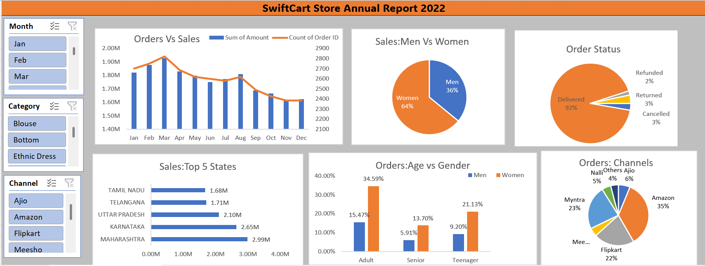

# SwiftCart Sales Excel Dashboard

## Project Overview

This project analyzes online retail sales data using Microsoft Excel and presents key business insights through an interactive dashboard.

## Tools Used

* Microsoft Excel
* Pivot Tables
* Pivot Charts
* Slicers
* Data Cleaning
* Dashboard Design

## Dashboard Features

* Monthly Sales Analysis
* Order Status Distribution
* Sales by Gender
* Top Performing States
* Sales Channel Analysis
* Customer Age Group Analysis

## Key Insights

* Women contribute the majority (64%) of sales.
* Amazon is the leading sales channel. 35% order is from Amazone
* Maharashtra generates the highest sales revenue.which is 2.99 million.
* 92% orders are successfully delivered.

## Business Recommendations

Based on the analysis of the SwiftCart Online Retail Sales Dataset, the following recommendations can help improve business performance:

### 1. Focus on Female Customers

Female customers contributed the majority of sales. The company should create targeted marketing campaigns, personalized offers, and loyalty programs for this customer segment.

### 2. Strengthen Top Sales Channels

Amazon generated the highest number of orders. The business should continue investing in high-performing channels while exploring ways to improve performance on lower-performing platforms.

### 3. Expand Presence in Top States

Maharashtra emerged as the highest revenue-generating state. Similar marketing and distribution strategies can be applied to other regions with growth potential.

### 4. Reduce Order Cancellations and Returns

Analyzing cancelled and returned orders can help identify operational issues and improve customer satisfaction.

### 5. Optimize Inventory Management

Top-selling categories and products should be prioritized to prevent stock shortages and improve fulfillment efficiency.

### 6. Seasonal Sales Planning

Monthly sales trends indicate demand fluctuations throughout the year. The business can use these insights to plan promotions and inventory levels more effectively.

### 7. Improve Customer Segmentation

Different age groups show different purchasing patterns. Segment-specific marketing campaigns can improve customer engagement and sales performance.

## Dataset

The project uses the SwiftCart Online Retail Sales Dataset containing customer, product, order, shipping, and sales information.

## Dashboard Preview

## Author

Zohair Baloch
Aspiring Data Analyst
